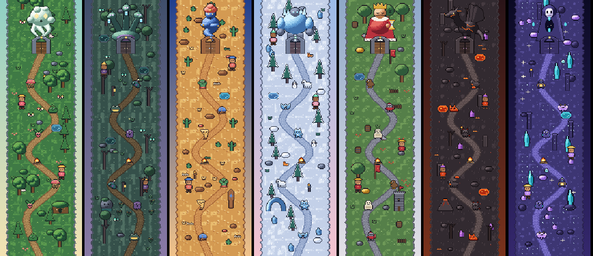
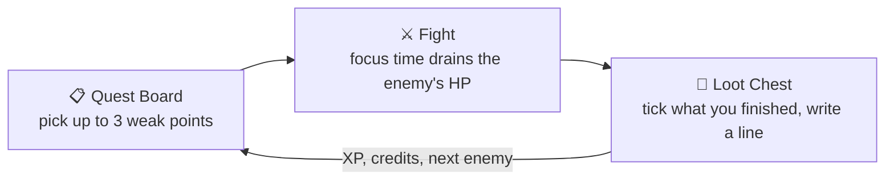
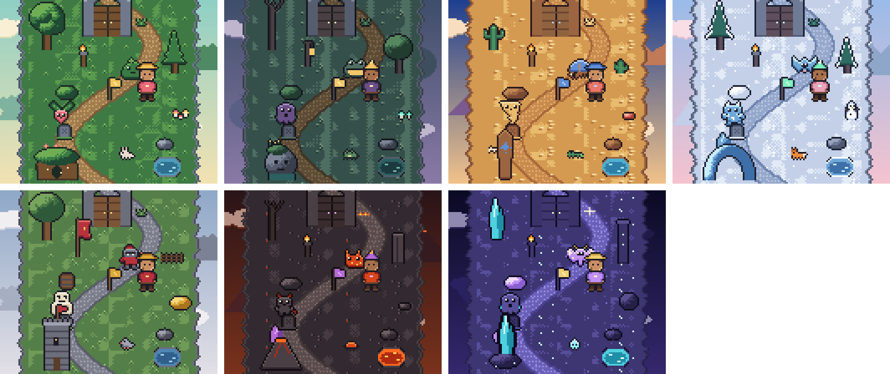
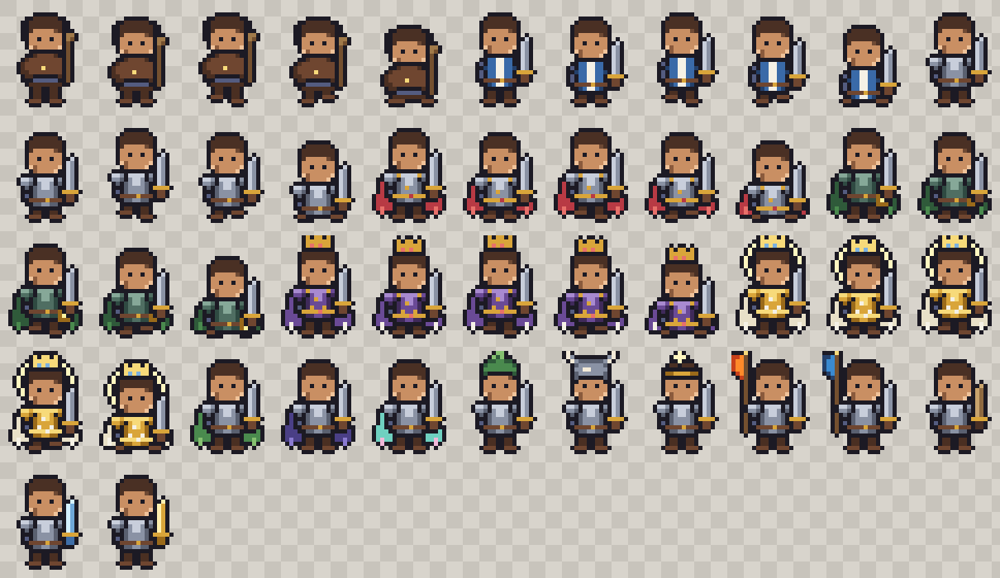
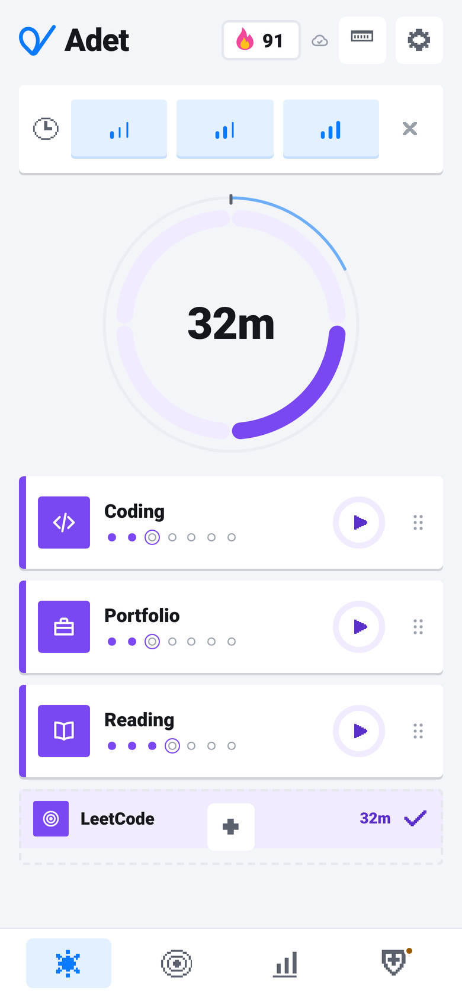
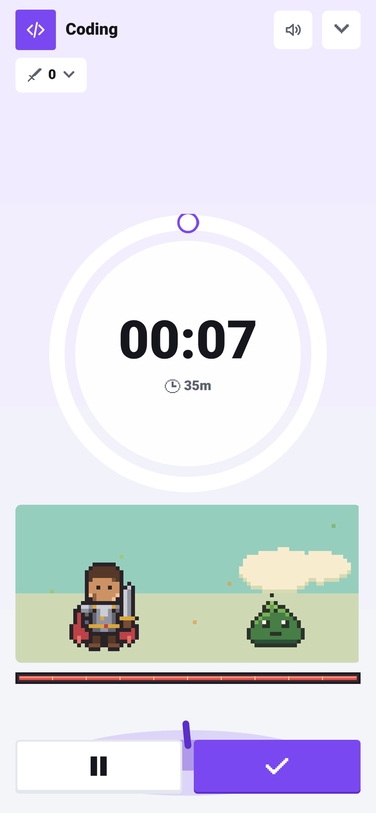
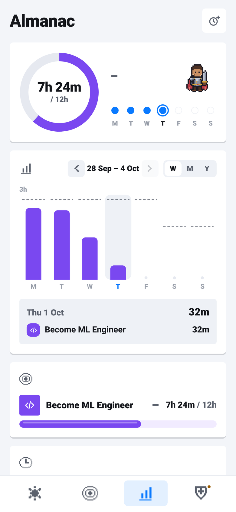
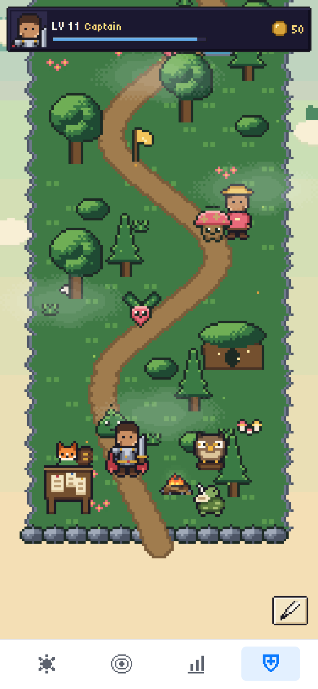
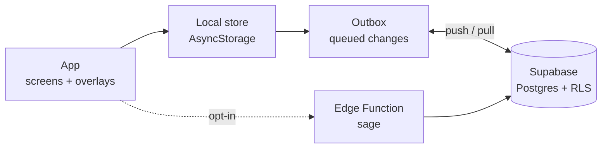

<div align="center">


# Adet

**әдет** · Kazakh for *"habit"*

A calm focus and habit tracker where your focused time fights through a pixel-art world.


<br /><br />



</div>

---

## 🌿 Why Adet

- **Forgiving and calm.** No guilt mechanics. A day with nothing planned is neutral, and the first unfinished day of each week is a rest day.
- **Focus sessions.** Start a timer in one tap.
- **Habit streaks.** A day counts when its plan is done, not when you hit an arbitrary number.
- **Quest Mode.** Optional. Your focused minutes become damage against pixel-art enemies. Nothing flashes, nothing nags.

## ✨ Features

| | |
|---|---|
| ⏱️ **Focus timer** | Start, pause and resume, with a live ring. Log time by hand if you forgot. |
| 🔥 **Habits and streaks** | Daily or weekly frequency, a minimum and a full target per habit, streak freezes. |
| 📅 **Task planning** | A daily plan within your time budget, a weekly rebalance, and projects with weekly targets. |
| 📶 **Local-first sync** | Works offline. Changes queue in an outbox and sync to Supabase when you are online. |
| 📊 **Stats** | Weekly and monthly charts, an activity heatmap and stage progress from Novice to Master. |
| ⚔️ **Quest Mode** | Seven biomes, bosses, loot chests, levels and ranks, all derived from your real sessions. |
| 🦉 **Sage assistant** | Optional AI suggestions. Works offline on local rules; the AI is opt-in and off by default. |

## ⚔️ Quest Mode

Quest Mode gives focused time a purpose. It lives in its own tab and never changes how a normal session works.



- **Fight.** A small Stage under the timer shows your character swinging at the current enemy. Pause and it naps.
- **Loot.** A session of 10+ minutes ends with a chest. Tap *Later* and it waits at camp, it never expires.
- **No pressure.** Game state is derived from your sessions, never stored. A burnout guard halves rewards after 4 hours a day.

### Meet the villagers

| | Name | Role |
|---|---|---|
| 🦉 | **Aqyl** (ақыл, "wisdom") | The Sage. Gives suggestions and recaps. |
| 🦊 | **Saudager** (саудагер, "merchant") | The Merchant. Sells streak freezes and cosmetics. |
| 🐢 | **Hatshy** (хатшы, "scribe") | The Scribe. Keeps your chronicle, chests, settings and credits. |

### Seven biomes

| # | Biome | Boss |
|---|---|---|
| 1 | Whispering Forest | The Fog Wisp |
| 2 | Mirewood Swamp | The Doomscroll Hydra |
| 3 | Sunscorch Desert | The Mirage Djinn |
| 4 | Frostpeak | The Frozen Titan |
| 5 | Iron Kingdom | King Tomorrow |
| 6 | Emberdeep Volcano | The Burnout Drake |
| 7 | Astral Citadel | The Hollow Echo |

After the Astral Citadel the journey loops (*Ascension*) with a night palette and tougher bosses.

<table>
  <tr>
    <td align="center"><br /><sub>One scene per biome</sub></td>
    <td align="center"><br /><sub>Seven avatar tiers</sub></td>
  </tr>
</table>

<details>
<summary>Balance, rewards and every rule</summary>

Every number lives in `src/domain/game/balance.ts`. The full rules, rewards, ceremonies and
asset pipeline are in [`docs/quest/README.md`](docs/quest/README.md).

</details>

## 📱 Screens

<table>
  <tr>
    <td align="center"><br /><sub>Today</sub></td>
    <td align="center"><br /><sub>Focus</sub></td>
    <td align="center"><br /><sub>Almanac</sub></td>
    <td align="center"><br /><sub>Quest</sub></td>
  </tr>
</table>

<sub>Captured from the web build at 390×844 with the app's built-in sample data.</sub>

## 🧰 Tech stack

<p>
  
</p>

- **Expo + React Native** with Reanimated and Skia, one codebase for iOS and web.
- **Local-first.** The device is the source of truth, so the app is fast and works offline.
- **Outbox sync.** Changes are queued and pushed, then pulled by cursor.
- **Last-write-wins.** Simple merging, with append-only rows for game achievements.
- **Supabase is the only backend.** Postgres with row-level security, email-code sign-in, and one Edge Function.

## 🏗️ Architecture



<details>
<summary>Design rules</summary>

- `src/domain/` is framework-free and unit-tested. Screens are thin and call selectors.
- Completion, streaks and game state are **derived**, never stored.
- Schema changes bump `CURRENT_SCHEMA_VERSION` and add a tested migration.
- More in [`docs/ARCHITECTURE.md`](docs/ARCHITECTURE.md).

</details>

## 🚀 Quick start

You need Node and a free [Supabase](https://supabase.com) project.

```bash
git clone https://github.com/trulyaldi/adet.git
cd adet
npm install
cp .env.example .env     # then fill in your Supabase URL and anon key
```

Run the SQL files in `supabase/migrations/` **by hand, in order** (`001` to `007`), in the Supabase SQL Editor.
A build that expects a column the server lacks stalls syncing on that device.

```bash
npx expo start           # scan the QR with Expo Go
npm run tunnel           # use this on WSL2 or when your phone can't reach your machine
npx expo export --platform web   # production web build into dist/
```

<details>
<summary>Environment variables</summary>

| Variable | Purpose |
|---|---|
| `EXPO_PUBLIC_SUPABASE_URL` | Your project URL (required) |
| `EXPO_PUBLIC_SUPABASE_ANON_KEY` | Your publishable key (required) |
| `EXPO_PUBLIC_QUEST_ENABLED` | `false` hides the Quest tab. Default on. |
| `EXPO_PUBLIC_SAGE_URL` | Edge Functions base URL. AI stays off without it. |

Other scripts: `npm run typecheck`, `npm run lint`, `npm test`.

</details>

## 🗂️ Project structure

<details>
<summary>Show the tree</summary>

```
App.tsx              Providers, tab switch, overlays
src/
  domain/            Pure logic: plans, streaks, stats, game rules (unit-tested)
    game/            Quest derivation, balance, biomes, ceremonies
  store/             State, actions, persistence
  sync/              Outbox, remote pull/push, auth
  screens/           Today, Projects, Stats, Quest, Sign-in
  overlays/          Sheets and the focus view
  components/        UI kit, motion, charts, celebrations
  game/              Quest rendering (Skia), assets, audio, content
  theme/ feedback/ notifications/ services/
supabase/
  migrations/        001 to 007, run by hand
  functions/sage/    The optional AI Edge Function
docs/                Architecture, Quest docs, media
scripts/             Asset, audio and balance tooling
```

</details>

## 🗺️ Roadmap

- [x] Local-first sync with Supabase
- [x] Quest Mode (PR #21) and Quest v2 encounters (PR #24)
- [x] Sage as a Supabase Edge Function (code in the repo, you deploy it yourself)
- [ ] Real art for every sprite (Adet's own stand-ins fill the gaps today)
- [ ] Music loops (sound effects ship, music is silent)
- [ ] TestFlight release
- [ ] Tauri desktop app
- [ ] Items and links knowledge graph
- [ ] Job tracker

## 🙏 Credits and licences

Quest Mode art and sound come from [Kenney](https://kenney.nl) (all CC0). Everything else is Adet's own.

| Asset | Author | Licence | Source |
|---|---|---|---|
| Tiny Town, Tiny Dungeon | Kenney | CC0 | [kenney.nl](https://kenney.nl/assets/tiny-town) |
| Interface, Impact, RPG Audio, Music Jingles | Kenney | CC0 | [kenney.nl](https://kenney.nl/assets/interface-sounds) |
| Tiny5 font | The Tiny5 Project Authors | SIL OFL 1.1 | [Google Fonts](https://fonts.google.com/specimen/Tiny5) |

The full, generated list is in [`assets/game/CREDITS.md`](assets/game/CREDITS.md), with each licence text under `assets/game/licenses/`.

**TODO:** this repo has no `LICENSE` file yet, so no licence is claimed for the source code.

---

<div align="center">
<sub>Built with calm, one session at a time 🌿</sub>
</div>
